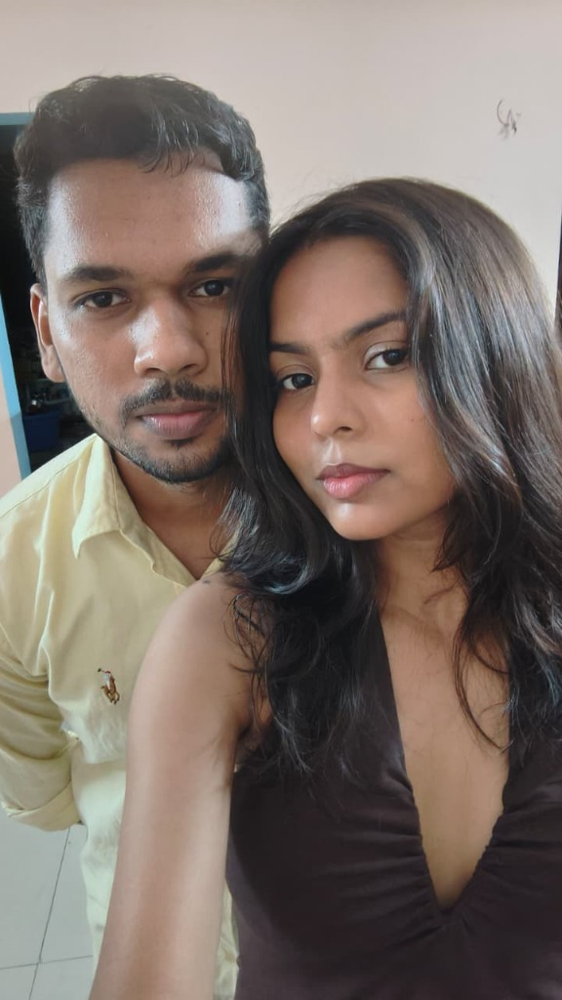

# Happy Birthday Radhika ❤️ — Our Love Story

A cinematic, luxury, romantic birthday website created for **Radhika Rajput**.

### 🌟 Key Highlights
- **10.10.2020 → Forever**: Live romantic counter showing years, days, hours, minutes, and seconds spent loving each other.
- **Interactive Love Story Timeline**: First meeting, coaching days, 3+ years of long distance, reunions, and the Rishikesh getaway.
- **Memory Vault (Photo Gallery)**: Romantic Polaroid cards with lightbox view. Easily replaceable with real couple pictures!
- **Wax-Sealed Love Letter**: Interactive unfold envelope animation revealing a heartfelt letter from Sunny.
- **Secret Birthday Gift**: Bouncing gift box with surprise love coupons and blowable virtual birthday candles.
- **Ambient Romantic Music & Hearts**: Floating hearts particle canvas with interactive tap explosion & Web Audio ambient melody generator.

### 📸 How to Replace Photos with Your Own Couple Pictures
1. Add your couple photos into the `images/` directory (e.g. `images/photo1.jpg`, `images/photo2.jpg`, etc.).
2. In `index.html`, update the `src` attribute of the polaroid cards to point to your new photos:
   ```html
   
   ```
3. Commit and push to GitHub — GitHub Pages will update automatically!

---
Crafted with ❤️ by **Sunny** for **Radhika Rajput**.
